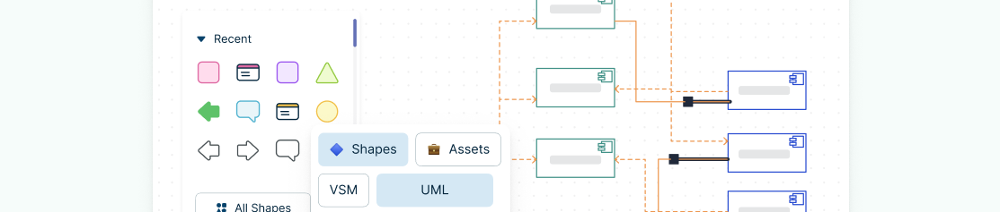

{width=100% align=center}

## 1. What is the UML ?
> **UML:** *Unified Modelling Language* (Ngôn ngữ mô hình hóa thống nhất) :bulb:

Tập hợp các *phần tử mô hình (model elements)* tạo thành các sơ đồ *UML (UML diagrams)*

Giúp mô hình hóa các giải pháp phần mềm, cấu trúc ứng dụng, hành vi hệ thống và quy trình kinh doanh

=== "Structure Diagrams"

    * Sơ đồ lớp (Class Diagram)
    * Sơ đồ thành phần (Component Diagram)
    * Sơ đồ triển khai (Deployment Diagram)
    * Sơ đồ đối tượng (Object Diagram)
    * Sơ đồ gói (Package Diagram)
    * Sơ đồ hồ sơ (Profile Diagram)
    * Sơ đồ cộng tác (Composite Structure Diagram)

=== "Behavioral Diagrams"

    * Sơ đồ tình huống sử dụng (Use Case Diagram)
    * Sơ đồ hoạt động (Activity Diagram)
    * Sơ đồ trạng thái (State Machine Diagram)
    * Sơ đồ trình tự (Sequence Diagram)
    * Sơ đồ liên lạc (Communication Diagram)
    * Sơ đồ tương tác (Interaction Overview Diagram)
    * Sơ đồ phối hợp thời gian (Timing Diagram)

<figure>
  
  <figcaption>UML Diagram Type</figcaption>
</figure>

## 2. A Common Language

## 3. Summary

### References
- [Creately Blog](https://creately.com/blog/diagrams/uml-diagram-types-examples/)
- [Visual Paradigm Guidge](https://www.visual-paradigm.com/guide/uml-unified-modeling-language/what-is-profile-diagram/)