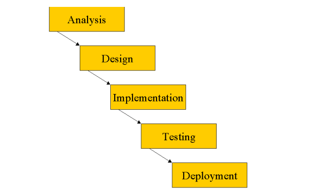
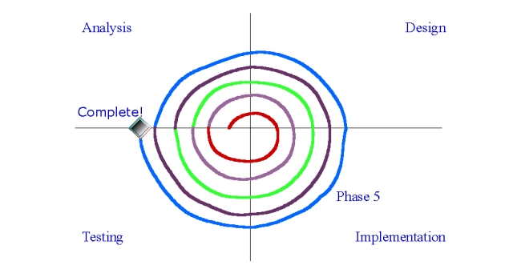

# Chapter 2 - The UML within a Development Process

## 1. The UML as a Notation
 >**UML:** chỉ đơn giản là một ngôn ngữ, một ký hiệu, một cú pháp.Điều quan trọng là nó không cho bạn biết cách phát triển phần mềm.

## 2. The Waterfall Model
Mô hình thác nước quy định rằng mỗi giai đoạn phải hoàn thành trước giai đoạn tiếp theo có thể bắt đầu.

  *Mô hình thác nước truyền thống:*

 
!!! note "Các vấn đề của mô hình thác nước : "

     * Độ phức tạp tăng lên trở nên khó khăn cho các nhà phát triển
	  * Chi phí khắc phục lỗi tăng theo cấp số nhân theo thời gian
	 * Đối với các dự án lớn, thời gian thực hiện dự án rất dài nên các giai đoạn sau như thử nghiệm phần mềm không cần thiết và làm tăng thêm chi phí cho nhân viên
     * Sản phẩm cuối cùng có thể không đúng ý của khách hàng.
???+ danger "Kết luận"  
    *Mô hình thác nước dễ hiểu và đơn giản để quản lý. Nhưng lợi thế của mô hình bắt đầu bị phá vỡ một khi sự phức tạp của dự án tăng.*

    

## 3. The Spiral Model

 >**Mô hình xoắn ốc:** Với mô hình này chia dự án thành vòng đời ngắn và mỗi vòng đời kết thúc bằng việc phát hành phần mềm thực thi.

 *Mô hình xoắn ốc:*
 

    
=== "Ưu điểm"

    * Cả nhóm làm việc kết hợp trong chu kỳ làm việc thay vì dành nhiều năm cho 1 hoạt động duy nhất
    * Có thể nhận được phản hồi sớm và thường xuyên từ khách hàng
    * Chúng ta có thể phát hiện các rủi ro
    * Quy mô và độ phức tạp của công việc được phát hiện sớm hơn
    * Dễ dàng đổi công nghệ và kết hợp công nghệ khác 
    * Dễ xem tiến dộ của dự án

=== "Nhược điểm"

    * Quá trình này thường được liên kết với Rapid Application Development, nó được nhiều người coi là đặc quyền của hacker.
    * Quá trình này khó quản lý hơn nhiều. 

## 4. Iterative, Incremental Frameworks
>**The Iterative, Incremental Framework** là một phần mở rộng hợp lý cho mô hình xoắn ốc, nhưng bài bản và chặt chẽ hơn.

Chia thành 4 giai đoạn chính:

    * Inception ( Khởi động)
    * Elaboration ( Soạn thảo)
    * Construction (Xây dựng)
    * Transition ( Chuyển tiếp)

## 5. Time Boxing

Đây là một cách tiếp cận cứng nhắc đặt ra một khoảng thời gian cố định trong đó một lần lặp lại cụ thể phải được hoàn thành trước đó. Nếu một lần lặp không hoàn thành vào cuối hộp thời gian, thì lần lặp đó vẫn kết thúc. Hoạt động quan trọng liên quan đến hộp thời gian là đánh giá ở cuối quá trình lặp lại. Larman cung cấp chi tiết về cách triển khai hộp thời gian.

!!! note "Lợi ích"

    * Vì cấu trúc cứng nhắc và phải lập kế hoạch chi tiết nên không bị loại bỏ khi dự án đã bắt đầu.
    * Nếu khung thời gian được xác định thì dự án ít cí xu hướng đi xuống
    * Dễ ngăn chặn việc tấn công.

## 6. Typical Project Timings

Thời gian cho một dự án phát triển phần mềm có thể khác nhau rất nhiều tùy thuộc vào các yếu tố như:

* Phạm vi của dự án
* Độ phức tạp của hệ thống
* Quy mô của nhóm phát triển
* Các tài nguyên sẵn có

## 7. The Rational Unified Process

<figure>
  
  <figcaption>RUP Framework</figcaption>
</figure>

> RUP là một phương pháp triển khai phần mềm do Rational Software tạo ra. RUP là một mô hình quy trình lặp đi lặp lại và gia tăng, cung cấp cách tiếp cận linh hoạt và có thể tùy chỉnh để phát triển phần mềm.

RUP dựa trên UML và cung cấp một tập hợp các phương pháp và kĩ thuật tốt nhất để phát triển phần mềm.
RUP được chia thành bốn giai đoạn

* Inception
* Elaboration
* Construction
* Transition

## 8. Summary

* Iterative, Incremental frameworks lại là các phương pháp phát triển phần mềm nhấn mạnh vào sự phát triển lặp đi lặp lại và gia tăng,
* Iterative, Incremental framework mang lại nhiều lợi ích so với các quy trình truyền thống.
* 4 giai đoạn của RUP là: **Khởi động** (Inception), **Chuẩn bị** (Elaboration), **Xây dựng** (Construction) và **Chuyển tiếp** (Transition)