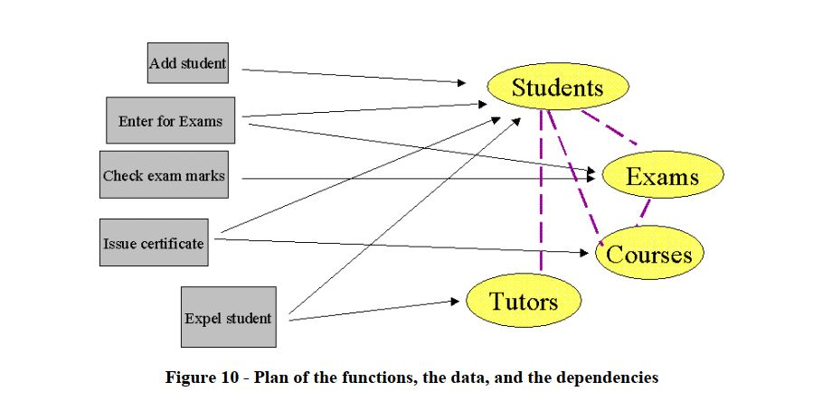
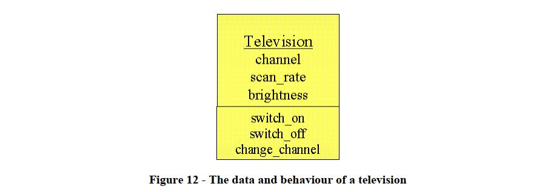

## 1. Structured Programming
> **Functional decomposition:** là một tiến trình phân chia các *functions* quá lớn, quá khó kiểm soát thành các *functions* nhỏ hơn để dễ hiểu, cũng như kiểm soát được nó.

Hầu hết *functions* sẽ yêu cầu dữ liệu để hoạt động. Và dữ liệu trong hệ thống thường được lưu ở dưới *database* hoặc có một số trường hợp trong *memory* như là các biến toàn cục. Các dữ liệu này thường phụ thuộc vào khi nên đôi khi sẽ có vấn đề xảy ra khi chúng ta thay đổi nó.
{width=100% align=center}

## 2. The Object Orientated Approach
> **OOP** giúp chúng ta giảm bớt tác động của các vấn đề kể trên bằng cách liên kết *data* và *functions* có liên quan đến nhau vào *module* giống nhau.

{width=100% align=center}

## 3. Encapsulation
> **Tính đóng gói (Encapsulation)** được hiểu nôm na là các *data* và các *functions/methods* có liên quan được đóng gói với nhau thành các *class* để tiện cho việc quản lý cũng như sử dụng. Nó có thể tránh được các vấn đề xung đột dữ liệu xảy ra.

## 4. Objects
> **Các đối tượng trong thế giới thực** đều được đặc trưng bởi *data* và *behaviour*.

Ví dụ như 1 chiếc TV là một đối tượng, nó có các dữ liệu như là các kênh, tần số quét, độ sáng, độ phân giải,...Và nó cũng có các hoạt động như là tắt mở, chuyển kênh,...Ở đây chúng ta cũng có thể trình bày các thông tin trên bằng cách ghi dưới dạng *modules* như những gì đã nhắc ở trên.

{width=100% align=center}

Vì thế, chúng ta có thể gọi các modules là các *Đối tượng/Objects*.

Chúng ta có thể thay đổi các *Objects* để phù hợp với ngữ cảnh. Vì thế mà *OOP* phản ánh khá tốt về thế giới thực. Khi có vấn đề cần phải thay đổi thì giải giáp sẽ rất dễ dàng.
## 5. Terminology
> **Dữ liệu/Data** của một đối tượng thường được gọi là các ***==Thuộc tính/Attributes==***.
Các hành vi khác nhau của mỗi đối tượng được gọi là các ***==Phương thức/Methods==***.
***==Lớp/Class==*** là một khuôn mẫu của mỗi đối tượng. Mỗi lớp sẽ diễn tả các thuộc tính cũng như các phương thức tồn tại.
## 6. The Object Oriented Strategy

## 7. Summary