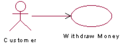

# Chapter 7 - Use Case Modelling

## Actors 
> **UML:** Một Use Case không thể tự khởi tạo các hành động mà bắt đầu bởi một *Actor*
<figure>
  
  <figcaption>Ký hiệu của actor</figcaption>
</figure>

    Actor không chỉ là con người mà có thể bất cứ điều gì bên ngoài. 

    Một Actor có thể tương tác với nhiều User Case đơn lẻ. Và một User Case có thể có nhiều Actor tương tác với nó.

<figure>
  
  <figcaption>Mối quan hệ của Actor với User Case.</figcaption>
</figure>

## The Purpose of Use Cases

* Định nghĩa hệ thống  => *Giúp tạo lập kích thước và phạm vi phát triển*
* Có xu hướng mơ hồ, khó hiểu => *Tập trung xa khỏi vấn đề.*
* Tất cả User Case là toàn bộ hệ thống => *Phải hòan tất và không có lỗ hỏng*
* Biểu đồ đơn giản, dễ hiểu => *Giao tiếp với khách hàng và nhà phát triển*
* Là bản tham khảo của các nhà phát triển.
* Ước tính thời gian phát triển.
* Cơ sỡ để tạo ra kiểm tra hệ thống.
* Gúp tạo hướng dẫn sử dụng.

## Use Case Granularity
    Trong một tình huống cụ thể thì khó quyết địn mức độ chi tiết của UserCase.

<figure>
  
  <figcaption> Sơ đồ người dùng máy ATM </figcaption>
</figure>

=> Nhiều UserCase và trở thành phức tạp.

!!! note "Các vấn đề của mô hình thác nước : "

    Để xử lý phức tạp của hệ thống. Cách tốt nhất là giữ nguyên tắc *UserCase phải đáp ứng mục tiêu cho Actor*

* *Áp dụng quy tắc trên, sửa lại sơ đồ trên ta được:*

## Use Case Descriptions
 Nhìn chung thì User Case Diagram khá là chung chung. Nên để trực quan hơn thì chúng ta cần diễn đạt nó một cách chi tiết hơn, nó gọi là **Đặc tả User Case**

Đặc tả Use Case tồn tại dưới dạng một cái bảng ghi chú. Nó mô tả tất tần tật các thông tin về Use Case

 Đặc tả User Case gồm 3 phần chính:

**Summary**

        •	Use Case Name
        •   Use Case ID
        •	Use Case Description
        •	Actor
        •	Priority
        •	Trigger.
        •	Pre-Condition
        •	Post-Condition
**Flow**

    •	Basic Flow
    •	Alternative Flow
    •	Exception Flow: 

**Additional Ìnfomation**

    •	Business Rule
    •	Non-Funtional Requirement

## Use Cases at the Elaboration Phase